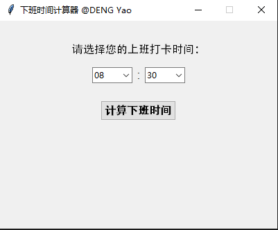
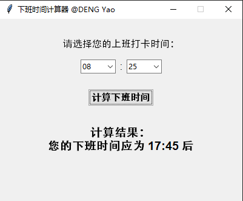
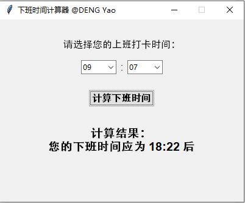
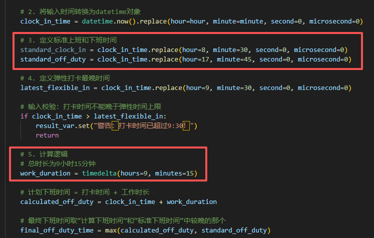

# 下班时间计算器 (Off Work Time Calculator)
在某公司上班摸鱼期间，写了个方便计算下班时间的python程序。*程序使用 tkinter 库实现（Python标准库，无需额外安装），并添加了详细注释。*
## 界面预览：

### 下班时间核心计算逻辑：
标准工作时长：从 8:30 到 17:45，总时长为9小时15分钟（包含中午1h15分吃饭午休时间）。

早上上班弹性打卡时间：早上 8:30 到 9:30。

**计算规则：**

如果打卡时间在 8:30 或之前，下班时间固定为 17:45；
如果打卡时间在 8:30 到 9:30 之间，下班时间 = 打卡时间 + 9小时15分钟；
如果打卡时间在9:30以后，则迟到。

为了简化处理，我们可以统一将下班时间计算为：打卡时间 + 9小时15分钟，然后与 17:45 取一个较晚的时间。

#### *可以根据自己公司的考勤时间在代码相应位置修改*
